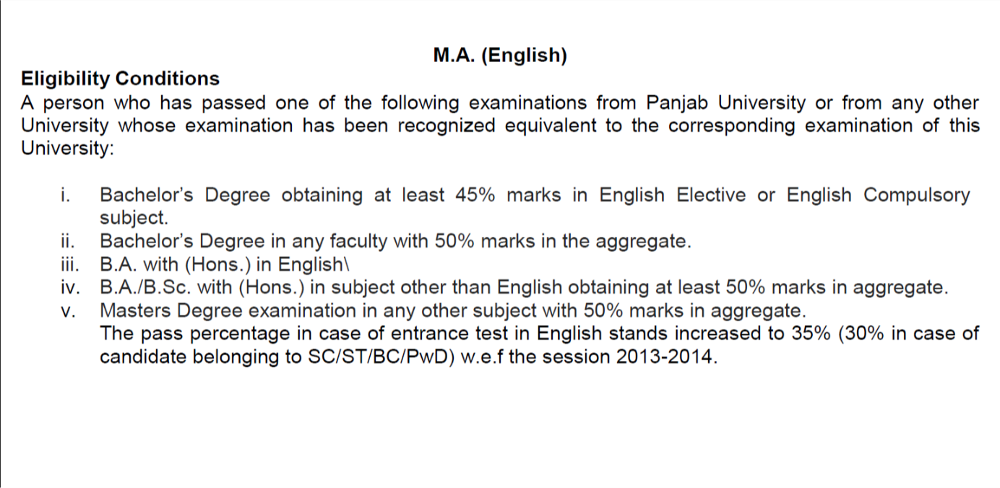

# Details of colleges with PG Admission for MA English Course
##  St. Xavier's University, Kolkata
### Website
* Official Website - https://www.sxuk.edu.in/default.htm
* PG Admission - https://www.sxuk.edu.in/admissions/sxuk-PGadmission.htm

  

> __NOTE:__

  

* Important Dates

  

	- Click __[HERE](http://sxuk.org/default.aspx)__ for online application.
* Scholarship

  

	- For more, click __[HERE](https://www.sxuk.edu.in/studentsSection/sxuk-Scholarship.htm)__

### MBA
* Official Website - https://www.sxuk.edu.in/xbs/default.htm

  

* Click __[HERE](https://www.sxuk.org/mba-default.aspx)__ for online application

## Calcutta University
* Form starting date: __09-July-2020__ in CU website.
* Form last date: __16-July-2020__

## Jadavpur University
* Official Website - http://www.jaduniv.edu.in/
* Eligibility Criteria

  

## Presidency University
* Official Website - https://presiuniv.ac.in/web/index.php
* Admission page - https://presiuniv.ac.in/web/admission.php
* Admission to PG courses PUMDET- 2020-21 - https://wbjeeb.nic.in/PUMDETCMS/public/home.aspx

  

* Important dates - https://wbjeeb.nic.in/PUMDETCMS/Handler/FileHandler.ashx?i=File&ii=277&iii=Y

  

* Old question paper (PUMDET MA English) - https://wbjeeb.nic.in/PUMDETCMS/Handler/FileHandler.ashx?i=File&ii=145&iii=Y
  - Also, available in folder ("..\wife_univ_admission\docs\question papers")
* Admission Guidelines

  

* Syllabus for PUMDET i.e. Click [here](./syllabus/presidency_univ_ug_english_syllabus.pdf) [SOURCE](https://www.presiuniv.ac.in/web/syllabus/ug_english.pdf)

## West Bengal State University (WBSU)
* Official Website - https://wbsu.ac.in/
* Admission page - https://wbsu.ac.in/admission-notice/

  

* Eligibility Criteria - https://www.wbsupgadmission.com/pg_admission/eligibility_Criteria.php
* Prospectus 2019 - https://www.wbsupgadmission.com/pg_admission/pdf/PROSPECTUS-2019.pdf
* Post graduate Homepage - https://www.wbsupgadmission.com/pg_admission/index.php
* Admission dates

  

## Panjab University (PU)
* Official Website - https://puchd.ac.in/
* Important dates & information for Entrance test - 2019

  

* List of Derecognised universities

  

* Contacts for PG programmes

  

* Admission Form

  

* Eligibility

  

* Scheme of Test

  

* Sample Paper

  

  

  

  

* M.A. English Date and Time

  

* Exam Weightage

  

## Rabindra Bharati University (RBU)
* Official Website - http://www.rbu.ac.in/
* Register yourself [__HERE__](http://admission.rbu.net.in/Login.aspx) for Regular Course.
* How to apply

  

* Documents during Admission

  

### RBU Distance Education Admission 2020
* Admission Notice

  

* Distance Education Eligibility Criteria

  

* Distance Education Application Form

  

* Distance Education Application Procedure

  

  

## Chandigarh University (CU)
* Official Website - https://www.cuchd.in/
* Websites
  - Question paper: http://cucet.cuchd.in/question-paper.php
  - List of Post graduation Courses: http://cucet.cuchd.in/afterGraduation.php
* CU-CET (2020) 
  - online examination
  - Apply here - http://cucet.cuchd.in/application-process.php
  - Fee: __Rs. 500__
  - Prospectus - __Rs. 500__
  - Examination last date: __20th may, 2020__
  - Sample question paper: http://cucet.cuchd.in/sample-papers.php
    + English (10 Qs.)

  

    + Basic Computer Knowledge (30 Qs.)

  

    + logical reasoning (30 Qs.)

  

    + Quantitative Aptitude (30 Qs.)

  

  - Exam time: 2 hrs
  - Marking: 100 Qs. (1 mark each), No negative marking
  - Passing mark (for scholarship): __40__ min. score
  - Scholarship Slab
    + 40-49.9 --> 5%
    + 50-59.9 --> 15%
    + 60-69.9 --> 20%
    + 70-79.9 --> 30%
    + 80-89.9 --> 40%
    + 95+ --> 100%
  - Fee structure
    +fresher party - nominal
    +examination - 2000/-
    +competition - 
    +tuition fee/semester - M.A (english) - 25,000

  - Seat Registration fee (advanced): 10,000 (No last date | first come, first serve basis)

